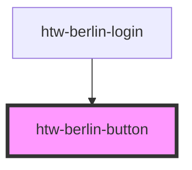

# htw-berlin-button

The Button is redered as an _anker_ by default. There are three major button _variants_ `filled`, `outlined` and `text`.

**Note that some dark mode styles only apply when hovered.**

### Usage guide

Use the variants as a way to create visual hierarchy between different actions:

- `variant="filled"` for primary actions e.g. saving data
- `variant="outlined"` for secondary actions e.g. cancelling a task
- `variant="text"` for tertiary actions e.g. a link in text

<!-- Auto Generated Below -->

## Properties

| Property   | Attribute   | Description                       | Type                                          | Default                      |
| ---------- | ----------- | --------------------------------- | --------------------------------------------- | ---------------------------- |
| `altTitle` | `alt-title` | alternative title                 | `string`                                      | `"Alternative Button Title"` |
| `color`    | `color`     | button color                      | `"blue" \| "disabled" \| "green" \| "orange"` | `'green'`                    |
| `dark`     | `dark`      | set true to use dark mode styling | `boolean`                                     | `false`                      |
| `href`     | `href`      | href property                     | `string`                                      | `"javascript:void(0)"`       |
| `type`     | `type`      | button type, default is anker <a> | `"default" \| "submit"`                       | `'default'`                  |
| `variant`  | `variant`   | button variant                    | `"filled" \| "outlined" \| "text"`            | `'filled'`                   |

## Dependencies

### Used by

 - [htw-berlin-login](../htw-berlin-login)

### Graph

----------------------------------------------

## Using Dark Styles 
When switching to dark mode styles, make sure to **select the dark background in the tool bar above** for best viewing results.
