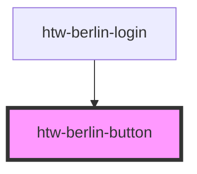

# htw-berlin-button

<!-- Auto Generated Below -->

## Properties

| Property   | Attribute   | Description                       | Type                                          | Default     |
| ---------- | ----------- | --------------------------------- | --------------------------------------------- | ----------- |
| `altTitle` | `alt-title` | alternative title                 | `string`                                      | `undefined` |
| `color`    | `color`     | button color                      | `"blue" \| "disabled" \| "green" \| "orange"` | `'green'`   |
| `dark`     | `dark`      | set true to use dark mode styling | `boolean`                                     | `false`     |
| `href`     | `href`      | href property                     | `string`                                      | `undefined` |
| `text`     | `text`      | text to be displayed in button    | `string`                                      | `undefined` |
| `type`     | `type`      | button type, default is anker <a> | `"default" \| "submit"`                       | `'default'` |
| `variant`  | `variant`   | button variant                    | `"filled" \| "outlined" \| "text"`            | `'filled'`  |

## Dependencies

### Used by

 - [htw-berlin-login](../htw-berlin-login)

### Graph

----------------------------------------------

*Built with [StencilJS](https://stenciljs.com/)*
