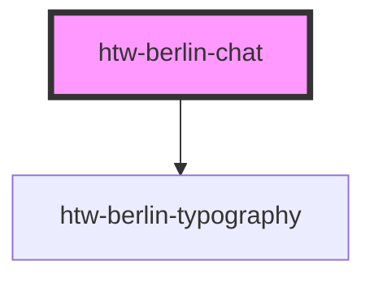

# htw-berlin-chat

<!-- Auto Generated Below -->

## Properties

| Property   | Attribute  | Description                     | Type                            | Default          |
| ---------- | ---------- | ------------------------------- | ------------------------------- | ---------------- |
| `color`    | `color`    | color scheme of chat            | `"blue" \| "green" \| "orange"` | `'green'`        |
| `dark`     | `dark`     | use dark mode if true           | `boolean`                       | `false`          |
| `fullname` | `fullname` | full name of user or group name | `string`                        | `"Example User"` |

## Dependencies

### Depends on

- [htw-berlin-typography](../htw-berlin-typography)

### Graph

----------------------------------------------

*Built with [StencilJS](https://stenciljs.com/)*
