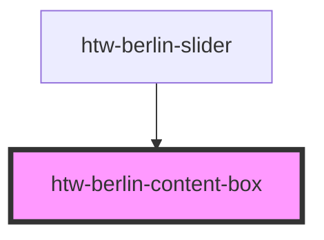

# htw-berlin-content-box

Content Boxes can be used to visually group elements in the user interface or can be used as a background.
**The `color` attribute is only applicable when `variant="color"` is also set.**

#### Usage suggestion

- use the `variant="default"` as a basis/background for content
- use the `variant="color"` for grouping high importance/attention content
- use the `variant="secondary"` for grouping secondary content

<!-- Auto Generated Below -->

## Properties

| Property  | Attribute | Description                                         | Type                                  | Default     |
| --------- | --------- | --------------------------------------------------- | ------------------------------------- | ----------- |
| `color`   | `color`   | pick color to apply to content when variant='color' | `"blue" \| "green" \| "orange"`       | `'green'`   |
| `dark`    | `dark`    | set true to apply dark mode                         | `boolean`                             | `false`     |
| `variant` | `variant` | set style to apply to the content box               | `"color" \| "default" \| "secondary"` | `'default'` |

## Dependencies

### Used by

 - [htw-berlin-slider](../htw-berlin-slider)

### Graph

----------------------------------------------

## Using Dark Styles 
When switching to dark mode styles, make sure to **select the dark background in the tool bar above** for best viewing results.
