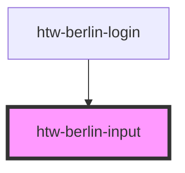

# htw-berlin-input

Input fields are a form element to collect text input from users. They are used by the [htw-berlin-login](../?path=/docs/design-system-organisms-login--login) for instance.

### Input + Label

Add a label to your Input field by defining the `label` attribute.

<!-- Auto Generated Below -->

## Properties

| Property      | Attribute     | Description                                                                    | Type                                 | Default                    |
| ------------- | ------------- | ------------------------------------------------------------------------------ | ------------------------------------ | -------------------------- |
| `altTitle`    | `alt-title`   | alternative title shown on hover                                               | `string`                             | `"Enter information here"` |
| `color`       | `color`       | color applied to the input field                                               | `"blue" \| "green" \| "orange"`      | `'green'`                  |
| `dark`        | `dark`        | use dark color theme if true                                                   | `boolean`                            | `undefined`                |
| `elementId`   | `element-id`  | id of input field                                                              | `string`                             | `undefined`                |
| `label`       | `label`       | label text to be displayed above input field                                   | `string`                             | `""`                       |
| `name`        | `name`        | name of input field                                                            | `string`                             | `undefined`                |
| `placeholder` | `placeholder` | placeholder text to be displayed in input                                      | `string`                             | `"Type..."`                |
| `state`       | `state`       | set the state of the input field                                               | `"active" \| "disabled" \| "normal"` | `'normal'`                 |
| `type`        | `type`        | set the [Input type](https://www.w3schools.com/html/html_form_input_types.asp) | `string`                             | `"text"`                   |

## Dependencies

### Used by

 - [htw-berlin-login](../htw-berlin-login)

### Graph

----------------------------------------------

## Using Dark Styles 
When switiching to dark mode styles, make sure to **select the dark background in the tool bar above** for best viewing results.
