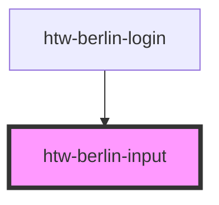

# htw-berlin-input

<!-- Auto Generated Below -->

## Properties

| Property      | Attribute     | Description                                  | Type                                 | Default                    |
| ------------- | ------------- | -------------------------------------------- | ------------------------------------ | -------------------------- |
| `altTitle`    | `alt-title`   | alternative title shown on hover             | `string`                             | `"Enter information here"` |
| `color`       | `color`       | color applied to the input field             | `"blue" \| "green" \| "orange"`      | `'green'`                  |
| `dark`        | `dark`        | use dark color theme if true                 | `boolean`                            | `undefined`                |
| `label`       | `label`       | label text to be displayed above input field | `string`                             | `""`                       |
| `placeholder` | `placeholder` | placeholder text to be displayed in input    | `string`                             | `"Type..."`                |
| `state`       | `state`       | set the state of the input field             | `"active" \| "disabled" \| "normal"` | `'normal'`                 |
| `type`        | `type`        | type of input                                | `string`                             | `"text"`                   |

## Dependencies

### Used by

 - [htw-berlin-login](../htw-berlin-login)

### Graph

----------------------------------------------

