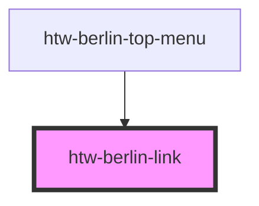

# htw-berlin-link

<!-- Auto Generated Below -->

## Properties

| Property   | Attribute   | Description                     | Type      | Default     |
| ---------- | ----------- | ------------------------------- | --------- | ----------- |
| `altTitle` | `alt-title` | alternative title               | `string`  | `undefined` |
| `dark`     | `dark`      | use dark mode if true           | `boolean` | `false`     |
| `href`     | `href`      | href property                   | `string`  | `undefined` |
| `orange`   | `orange`    | use orange color scheme if true | `boolean` | `false`     |
| `text`     | `text`      | text to be displayed in link    | `string`  | `undefined` |

## Dependencies

### Used by

- [htw-berlin-top-menu](../htw-berlin-top-menu)

### Graph

---

_Built with [StencilJS](https://stenciljs.com/)_
