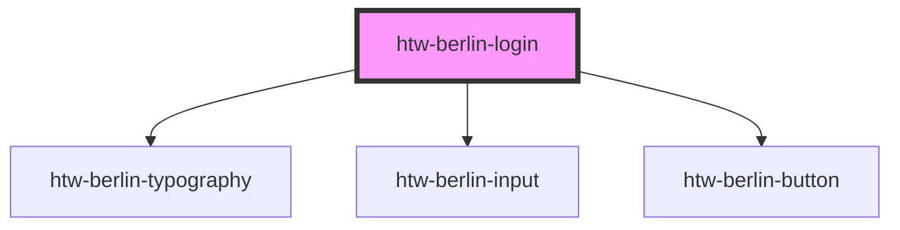

# htw-berlin-login

<!-- Auto Generated Below -->

## Properties

| Property | Attribute | Description           | Type                            | Default   |
| -------- | --------- | --------------------- | ------------------------------- | --------- |
| `color`  | `color`   | color scheme of login | `"blue" \| "green" \| "orange"` | `"green"` |
| `dark`   | `dark`    | use dark mode if true | `boolean`                       | `false`   |

## Dependencies

### Depends on

- [htw-berlin-typography](../htw-berlin-typography)
- [htw-berlin-input](../htw-berlin-input)
- [htw-berlin-button](../htw-berlin-button)

### Graph

----------------------------------------------

*Built with [StencilJS](https://stenciljs.com/)*
