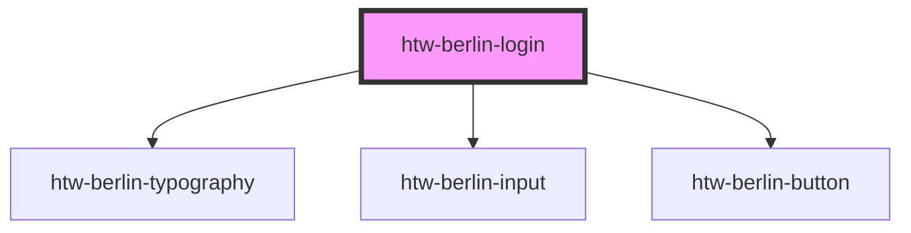

# htw-berlin-login

The Login component offers a user interface for signing in HTW Berlin users to their account by providing their email and password.

It utilises the following components:

- [htw-berlin-typography](../?path=/docs/design-system-particles-typography--typography)
- [htw-berlin-input](../?path=/docs/design-system-particles-input--input)
- [htw-berlin-button](../?path=/docs/design-system-particles-button--button)

<!-- Auto Generated Below -->

## Properties

| Property | Attribute | Description           | Type                            | Default   |
| -------- | --------- | --------------------- | ------------------------------- | --------- |
| `color`  | `color`   | color scheme of login | `"blue" \| "green" \| "orange"` | `'green'` |
| `dark`   | `dark`    | use dark mode if true | `boolean`                       | `false`   |

## Dependencies

### Depends on

- [htw-berlin-typography](../htw-berlin-typography)
- [htw-berlin-input](../htw-berlin-input)
- [htw-berlin-button](../htw-berlin-button)

### Graph

---

## Using Dark Styles

When switiching to dark mode styles, make sure to **select the dark background in the tool bar above** for best viewing results.
