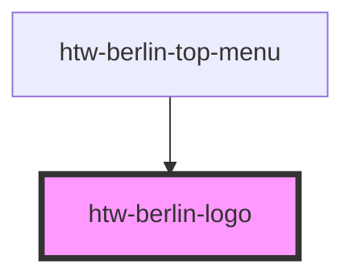

# htw-berlin-logo

The HTW Berlin logo can be used in three different `size`s

It is used by the [htw-berlin-top-menu](../?path=/docs/design-system-molecules-top-menu--standard).

<!-- Auto Generated Below -->

## Properties

| Property   | Attribute   | Description                                         | Type                            | Default                    |
| ---------- | ----------- | --------------------------------------------------- | ------------------------------- | -------------------------- |
| `altTitle` | `alt-title` | alternative title for the link wrapper              | `string`                        | `"Alternative Link Title"` |
| `color`    | `color`     | color scheme                                        | `"blue" \| "green" \| "orange"` | `'green'`                  |
| `dark`     | `dark`      | use dark mode if true                               | `boolean`                       | `false`                    |
| `href`     | `href`      | set href property to add a link wrapper to the logo | `string`                        | `""`                       |
| `size`     | `size`      | render logo in different sizes                      | `"l" \| "m" \| "s"`             | `'s'`                      |

## Dependencies

### Used by

 - [htw-berlin-top-menu](../htw-berlin-top-menu)

### Graph

----------------------------------------------

## Using Dark Styles 
When switiching to dark mode styles, make sure to **select the dark background in the tool bar above** for best viewing results.
