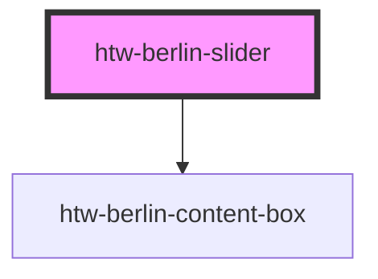

# htw-berlin-slider

<!-- Auto Generated Below -->

## Properties

| Property     | Attribute     | Description                                       | Type                            | Default   |
| ------------ | ------------- | ------------------------------------------------- | ------------------------------- | --------- |
| `color`      | `color`       | color scheme of wizard                            | `"blue" \| "green" \| "orange"` | `'green'` |
| `dark`       | `dark`        | use dark mode if true                             | `boolean`                       | `false`   |
| `showStatus` | `show-status` | display the slide status/numbers (e.g. Slide 2/5) | `boolean`                       | `true`    |

## Dependencies

### Depends on

- [htw-berlin-content-box](../htw-berlin-content-box)

### Graph

----------------------------------------------

## Using Dark Styles 
When switiching to dark mode styles, make sure to **select the dark background in the tool bar above** for best viewing results.
