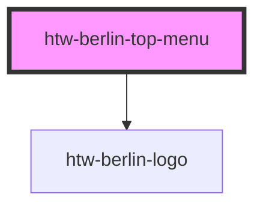

# htw-berlin-top-menu

The top menu can include **n** [htw-berlin-links](../?path=/docs/design-system-atoms-link--link), **one** [htw-berlin-dropdown](../?path=/docs/design-system-molecules-dropdown-menu--dropdown-menu) menu and **one** [htw-berlin-avatar](../?path=/docs/design-system-atoms-avatar--avatar). These should be placed into their according slots.

#### Top Menu Links

- For wrapped [links](../?path=/story/design-system-atoms-link--link) set the link attribute `variant="top-menu"` and `slot="links"`.
- See the [link docs](../?path=/docs/design-system-atoms-link--link) for setting link color and dark mode

#### Avatar & Dropdown slots

- The [avatar](../?path=/docs/design-system-atoms-avatar--avatar) in the top-menu should be passed with attribute `slot="avatar"`
- The [dropdown](../?path=/docs/design-system-molecules-dropdown-menu--dropdown-menu) in the top-menu should be passed with attribute `slot="dropdown"`

<!-- Auto Generated Below -->

## Properties

| Property       | Attribute      | Description                                                   | Type                            | Default   |
| -------------- | -------------- | ------------------------------------------------------------- | ------------------------------- | --------- |
| `color`        | `color`        | color scheme of menu                                          | `"blue" \| "green" \| "orange"` | `'green'` |
| `dark`         | `dark`         | use dark mode if true                                         | `boolean`                       | `false`   |
| `logo`         | `logo`         | set to false to hide htw logo                                 | `boolean`                       | `true`    |
| `shouldscroll` | `shouldscroll` | Menu fixed at top by default. Set true to scroll with content | `boolean`                       | `false`   |

## Dependencies

### Depends on

- [htw-berlin-logo](../htw-berlin-logo)

### Graph

----------------------------------------------

## Using Dark Styles 
When switiching to dark mode styles, make sure to **select the dark background in the tool bar above** for best viewing results.
