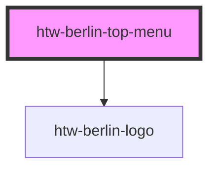

# htw-berlin-top-menu

The top menu can include n htw-berlin-link elements, one htw-berlin-dropdown menu and one htw-berlin-avatar. These should be placed into their according slots by defining slot="link", slot="avatar", slot="dropdown" attributes for each slotted element.

<!-- Auto Generated Below -->

## Properties

| Property       | Attribute      | Description                                                   | Type                            | Default   |
| -------------- | -------------- | ------------------------------------------------------------- | ------------------------------- | --------- |
| `color`        | `color`        | color scheme of menu                                          | `"blue" \| "green" \| "orange"` | `'green'` |
| `dark`         | `dark`         | use dark mode if true                                         | `boolean`                       | `false`   |
| `logo`         | `logo`         | set to false to hide htw logo                                 | `boolean`                       | `true`    |
| `shouldscroll` | `shouldscroll` | Menu fixed at top by default. Set true to scroll with content | `boolean`                       | `false`   |

## Dependencies

### Depends on

- [htw-berlin-logo](../htw-berlin-logo)

### Graph

----------------------------------------------

*Built with [StencilJS](https://stenciljs.com/)*
