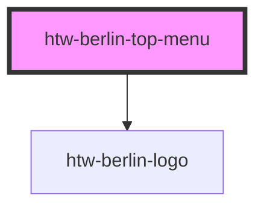

# htw-berlin-top-menu

<!-- Auto Generated Below -->

## Properties

| Property | Attribute | Description           | Type                            | Default   |
| -------- | --------- | --------------------- | ------------------------------- | --------- |
| `color`  | `color`   | color scheme of menu  | `"blue" \| "green" \| "orange"` | `"green"` |
| `dark`   | `dark`    | use dark mode if true | `boolean`                       | `false`   |
| `logo`   | `logo`    | hide htw logo if true | `boolean`                       | `true`    |

## Dependencies

### Depends on

- [htw-berlin-logo](../htw-berlin-logo)

### Graph

----------------------------------------------

*Built with [StencilJS](https://stenciljs.com/)*
