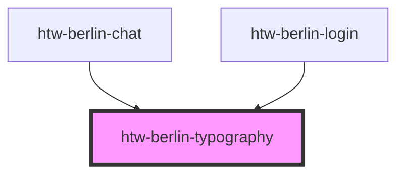

# htw-berlin-typography

Component for HTW Berlin typography.

#### Usage suggestion

- Use `color="copy"` for long texts
- Do not use colors except `color="copy"` on dark backgrounds _(readability is otherwise not sufficient)_
- Colors `green`, `blue` and `orange` can be used to put a highlight on something

<!-- Auto Generated Below -->

## Properties

| Property    | Attribute   | Description                                          | Type                                                    | Default    |
| ----------- | ----------- | ---------------------------------------------------- | ------------------------------------------------------- | ---------- |
| `color`     | `color`     | link color                                           | `"blue" \| "copy" \| "green" \| "grey" \| "orange"`     | `'copy'`   |
| `dark`      | `dark`      | use dark mode if true - reverses copy color to white | `boolean`                                               | `false`    |
| `fontstyle` | `fontstyle` | specify the font-style of the typogrphy element      | `"bold" \| "bolditalic" \| "italic" \| "normal"`        | `'normal'` |
| `tag`       | `tag`       | specify the html tag of the typogrphy element        | `"h1" \| "h2" \| "h3" \| "h4" \| "h5" \| "p" \| "span"` | `'span'`   |

## Dependencies

### Used by

- [htw-berlin-chat](../htw-berlin-chat)
- [htw-berlin-login](../htw-berlin-login)

### Graph

---

## Using Dark Styles

When switiching to dark mode styles, make sure to **select the dark background in the tool bar above** for best viewing results.
