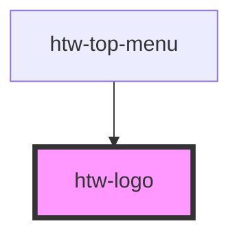

# htw-logo

<!-- Auto Generated Below -->

## Properties

| Property | Attribute | Description                     | Type                | Default     |
| -------- | --------- | ------------------------------- | ------------------- | ----------- |
| `dark`   | `dark`    | use dark mode if true           | `boolean`           | `false`     |
| `href`   | `href`    | href property                   | `string`            | `undefined` |
| `orange` | `orange`  | use orange color scheme if true | `boolean`           | `false`     |
| `size`   | `size`    | render logo in different sizes  | `"l" \| "m" \| "s"` | `"m"`       |

## Dependencies

### Used by

 - [htw-top-menu](../htw-top-menu)

### Graph

----------------------------------------------

*Built with [StencilJS](https://stenciljs.com/)*
