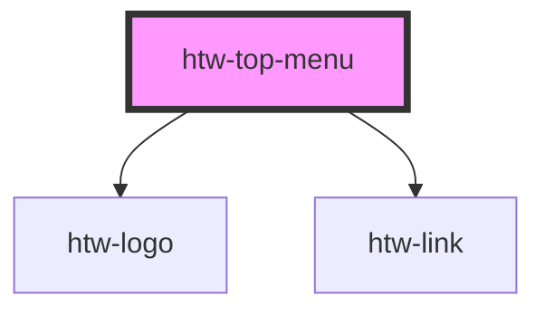

# htw-top-menu

<!-- Auto Generated Below -->

## Properties

| Property | Attribute | Description                     | Type      | Default |
| -------- | --------- | ------------------------------- | --------- | ------- |
| `dark`   | `dark`    | use dark mode if true           | `boolean` | `false` |
| `orange` | `orange`  | use orange color scheme if true | `boolean` | `false` |

## Dependencies

### Depends on

- [htw-logo](../htw-logo)
- [htw-link](../htw-link)

### Graph

----------------------------------------------

*Built with [StencilJS](https://stenciljs.com/)*
